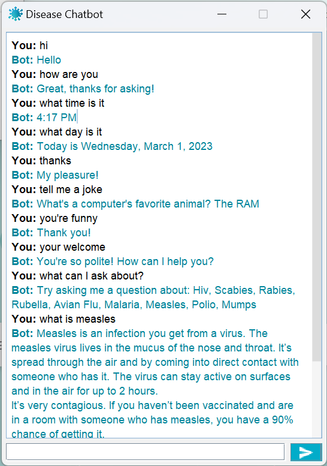

# Disease ChatBot
Chatbot with a simple GUI that can answer questions related to a list of supported diseases based on infomation gathered from CDC and WebMD pages. Current supported diseases: HIV, Scabies, Rabies, Rubella, Avian Flu, Malaria, Measles, Polio, and Mumps.

## Usage
Download the DiseaseChatbot.jar file. Run this file by simply opening the .jar file.
If the application doesn't open directly, the .jar file can also be run from the terminal. Navigate to the directory where the DiseaseChatbot.jar file is stored, and run 'java -jar DiseaseChatbot.jar'. This application requires at least Java 14.
## Folders
### src
##### DiseaseWebScraper.java
Parses disease information from WebMD and CDC websites for certain diseases. (Project 1)
##### DiseaseDataProcessor.java
Processes information for a provided disease and attempts to identify and answer prompts based on the stored information for that disease. (Project 2)
##### DiseaseChatBot.java
Uses DiseaseWebScraper and DiseaseDataProcessor to take user input regarding a disease and generates a response. Also accounts for some general "small talk" questions. (Project 3)
##### ChatBot.java
Interface to represent a chatbot. The bot must provide a method to able to take a String user entry and provide a String response. (Project 3)
##### ChatBotGui.java
Takes an implementation of the ChatBot interface and creates a simple, customizable GUI for the user to enter input and see the ChatBot responses. (Project 3)
##### SpellingCorrector.java
Provides a simple API for using Jazzy to correct text based on the provided dictionary file. (Project 4)
### data
Contains the text files generated for each disease from DiseaseWebScraper and read by DiseaseDataProcessor. 
### doc
Contains the project report and a UML diagram of the system.
### html
Contains HTML files for CDC and WebMD pages for DiseaseWebScraper to use in the case that it fails to load the webpages.
### dictionary
Contains a text file of keywords to use for spell correcting by SpellingCorrector
### lib
Contains external libraries used in project.
### test 
Contains an image of the GUI with an example chat session, an example text file "chat-session-example.txt" printed from a session with most of the possible questions and generated responses,  and the "chat-session" text file which is printed from the most recently run session.
